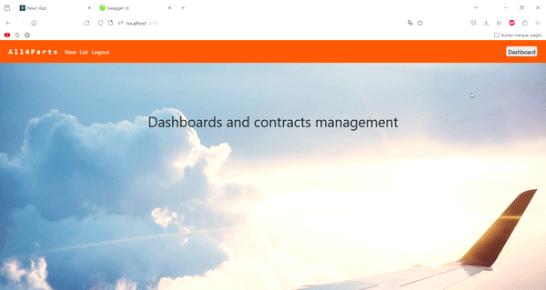

# Client-Dashboard

## Dependencies
This service requires the gateway, users-service, and contract-service to function properly. You'll be redirected to the [back-end repository](https://github.com/4PROJ-5PROJ-Namkin/microservice-backend) to run these services.

## Getting Started
To launch Client-Dashboard, use the command `docker compose up --build` executed at the root of the project. This initiates the necessary services and sets up the environment for the application to run.

## Features
### User Registration and Login
Users must register and log in to access the tools provided by Client-Dashboard.
### SSO (Single Sign On)
Sadly this feature isn't implemented because of no right was granted by the Azure administrator to access to the Azure AD. To bypass this issue, a basic RBAC (Role-Based Access Control) verification mechanism is implemented beforehand. By default, a user is assigned the role of "commercial" which allows for managing contracts and accessing dashboards.
### Contract Management
The user has the access to view the list of all his active contracts and create new one or delete existant one. All the operations of the CRUD are supported.
### Reporting tool
The current dashboards are powered by the [Power BI Embedded SDK](https://learn.microsoft.com/en-us/power-bi/developer/embedded/) embarked and integrated in the React Application. The usage of the SDK will streamline data integration and report generation in near real time.

### Dashboard Accessibility And Scope
Access to dashboards is role-dependent. Users with the appropriate permissions can navigate to the dashboards by clicking the "Dashboard" button located on the right side of the header.
### Demonstration
A button labeled "Contracts" appears when users are viewing the dashboards. This button enables users to easily toggle back to the previous interface. To see this feature in action, refer to the GIF located at `./ToggleInterface.gif`.

The GIF demonstrates how users can switch between the dashboard view and the previous interface seamlessly, enhancing the user experience.
